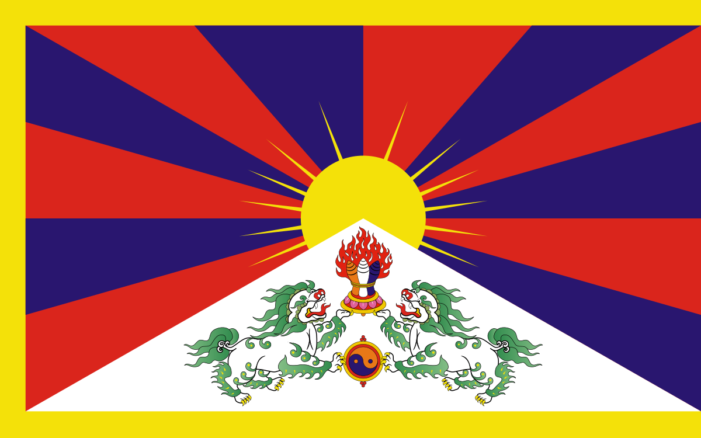

18-11-2021 at 12:28
#Tibet 

---
# Tibet
---

## Introduction to Tibet 

1. Tibet is located on the Tibetan plateau west? of the gobi desert and is apart of the peoples republic of china
2. it has a population of 3.5 million
3.  
4. Tibetan and English 
5. Lhasa
6. Xigase, Qamdo, Lhasa, Nagqu, Shannan, Nyingchi, Ngari

Tibet is located in China. Its population is 3.5 million, its flag is the snow lion flag and it is blue, red. yellow and white. The language spoken is Tibetan. The capital city is Lhasa, Tibet is made up of seven prefectures, Xigase, Qamdo, Lhasa, Nagqu, Shannan, Nyingchi, Ngari.

# Investigating the Tibetan railroad.
LI: to further investigate the Tibetan railroad 

| Environmental features of Tibet    | Facts about the train      | How the railway was made   | Issues they faced constructing the railway | Issues people experience 
|-------------- | -------------- | -------------- | --------------| ---------|
| Item1    | Item1     | Item1     | | | | 
 

